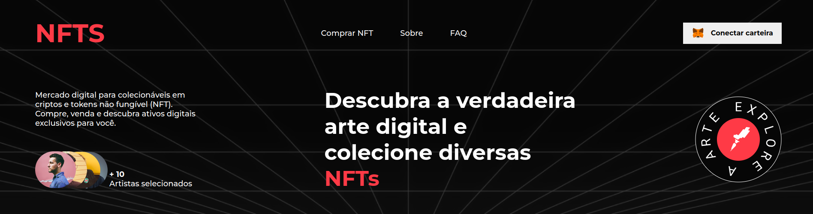
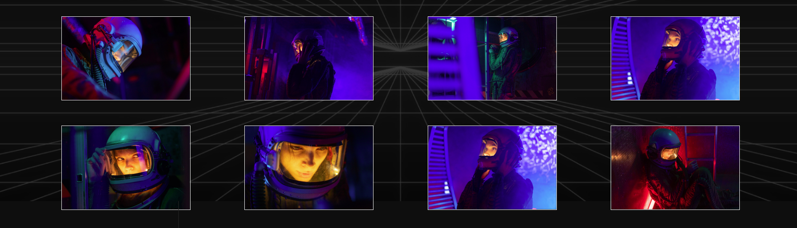
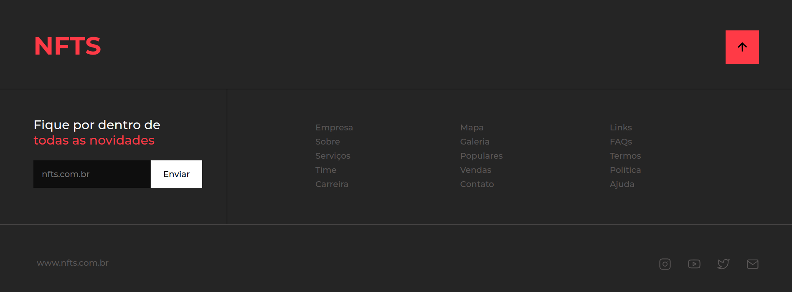

# Nfts

## Technologies used

This project was done using the following technologies

 **HTML**

 **CSS**

## Objective of project

This project was intended to be an exercise in basic knowledge that I had already acquired. However, it simulates a website, as it is a landing page it can have numerous functions, such as transmitting news, information, making purchases and many other things.

## What I learned from this project

The project in question exercised and improved the following knowledge:

- DOM manipulation
- CSS Variables
- Using relative measures in CSS
